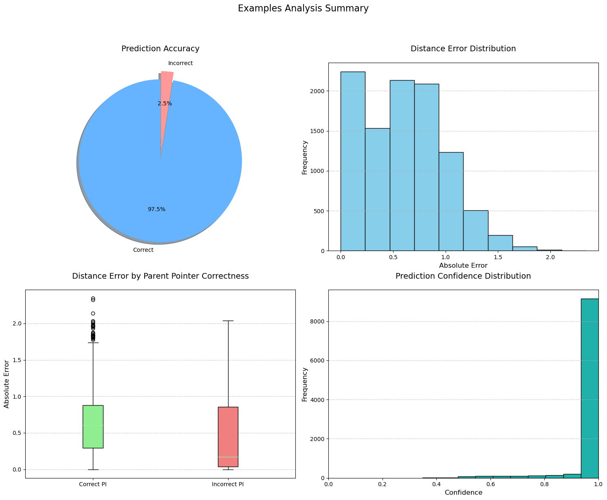
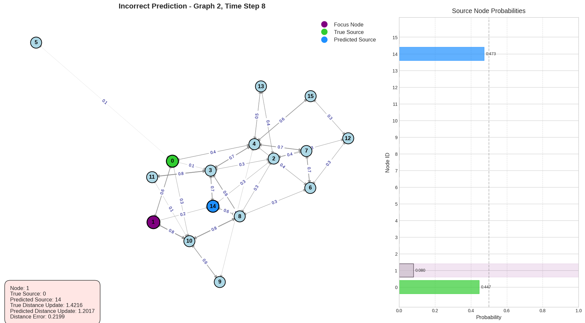

# NAR Interpretation on CLRS Dataset

This repository contains code for Neural Algorithm Reasoning (NAR) interpretation on the CLRS Algorithmic Reasoning Dataset.

## Edits over original CLRS code
Some code from the `algorithms/graph.py` has been modified to create extra labels for training. This includes sometimes letting the algorithm run till end (disable early termination) to prevent instances where there are not many time steps to train on. For the BFS algorithm this is not possible, so early cutoff used (but clipped below at 2 time steps).

## Repository Structure

### Data Folder
The `data` folder contains processed interpretation dataset files used for training and evaluation. See `interp/create_dataset.py` for details of data generation`.
- Preprocessed algorithm execution hiddenstates
- Graph structures and features

### Interp Folder
The `interp` folder contains the core implementation for neural algorithm interpretation:

#### `models.py`
Contains neural network architectures for algorithm interpretation:
- `GNNLayer`: Graph neural network layer with message passing
- `GNNInterpNetwork`: GNN-based model for interpretation of single algorithms
- `GNNJointInterpNetwork`: GNN-based model for joint interpretation training of multiple algorithms
- `TransformerInterpNetwork`: Transformer-based architecture for interpreting algorithm executions

#### `dataset.py`
Handles data loading and preprocessing:
- Custom collation functions for batching graph data
- Functions to process algorithm execution traces
- Utilities for handling multiple algorithms simultaneously

#### `train.py`
Training loop implementation:
- Model training and evaluation procedures
- Loss functions for algorithm interpretation
- Optimisation and learning rate scheduling

#### `create_dataset.py`
Creating datasets for interpretation.
- Joint algo dataset creation and single algo creation

#### `evaluation.py`
Provides comprehensive evaluation tools for algorithm interpretation models:
- Functions for evaluating model performance on test datasets
- Metrics calculation for different algorithm types
- Utilities for comparing model predictions against ground truth

#### `metric.py`
Implements custom metrics for evaluating algorithm interpretation quality:
- Loss function customisation for training process
- sigma_1 and sigma_2 specification

#### `visualisation.py`
Tools for visualising algorithm execution and model interpretations:
- Graph visualisation functions with node and edge attributes
- Step-by-step algorithm execution visualisation
- Comparison views between ground truth and model predictions

#### `config.py`
Configuration management for experiments:
- Hyperparameter definitions for different model architectures
- Training configuration options (batch size, learning rate, etc.)
- Dataset configuration settings
- Building models from configs
- Config folder `interp/configs` contains examples.

## Algorithms
The repository supports interpretation of various graph algorithms from the CLRS dataset, including:
- Breadth-First Search (BFS)
- Bellman-Ford
- Dijkstra's Algorithm
- Prim's Algorithm (MST)

## Usage
Instructions for training and evaluating models are provided in the respective script files. 
- Main training run on `train.py`
- Testing and visualisation on `train.ipynb`
- Dataset creation for interpretation networks in `create_dataset.py`
- Dataset visualisation for interpretation networks in `CreateDataset.ipynb`

### Installing requirements
Creating new environment is recommended. After activating python environment, run

    pip3 install -r requirements/requirements.txt

### Creating a Dataset and Training a Model

#### Creating a Dataset

To create a dataset for algorithm interpretation, use the `create_dataset.py` script. This script supports creating datasets for individual algorithms or joint datasets for multiple algorithms.

For example dataset creation for a single algorithm (Bellman-Ford):

    python -m interp.create_dataset --algo bellman_ford --dataset all -s 5000

All validation is run on datasets of graph size 16, so we must create those before doing any training:

    python -m interp.create_dataset --algo bellman_ford --dataset 16 -s 500 -e

For joint dataset creation, separate you algorithms with `+` and no spaces. For example for Bellman-Ford and BFS:

    python -m interp.create_dataset --algo bellman_ford+bfs --dataset all -s 5000

For a complete list of options:

    python -m interp.create_dataset --help

#### Training a Model

To train a model on the created dataset, use the `train.py` script. This script supports training on individual algorithms or joint training on multiple algorithms. Training is primarly described from training configs in the `interp/config` folder, but some arguments can be overridden via commandline.

For training on a single algorithm (e.g., Bellman-Ford) for a gnn_small example:

    python -m interp.train --config interp/configs/gnn_small.yaml --algo bellman_ford

For joint training on multiple algorithms, use the same syntax but with config that is specific to joint training:

    python -m interp.train --config interp/configs/gnn_small_joint.yaml

For a complete list of options:

    python -m interp.train --help

### Evaluating a Model

For visualisation and detailed analysis, use the `train.ipynb` notebook which provides interactive visualizations of model predictions compared to ground truth.

